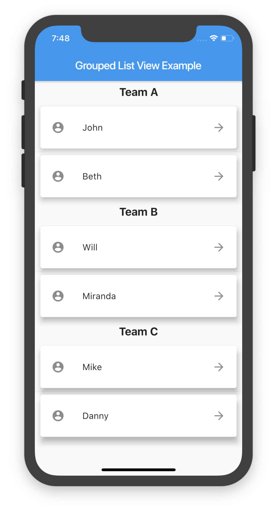

# Grouped list package for Flutter 

A Flutter `ListView` in which list items can be grouped to sections.



## Getting Started

 Add the package to your pubspec.yaml:

 ```yaml
 grouped_list:
    path: ../grouped_list
 ```
 
 In your dart file, import the library:

 ```Dart
import 'package:grouped_list/grouped_list.dart';
 ``` 
 
 Instead of using a `ListView` use `GroupedListView` and create your list with the builder constructor:
 
 ```Dart
  GroupedListView(
    elements: _elements,
    groupBy: (element) => element['group'],
    groupSeparatorBuilder: _buildGroupSeparator,
    itemBuilder: (context, element) => Text(element['name']),
  ),
```

You can use all fields from `ListView` but you have to specify three extra fields: 

#### Required Parameters:

* `elements`: A list of the data you want to display in the list.
* `groupBy`: Function which maps an element to its grouped value. 
* `itemBuilder`: Function which returns an Widget which defines the item.
* `groupSeparator`: Function which returns an Widget which defines the section separator.
```Dart
Widget _buildGroupSeparator(dynamic groupByValue) {
  return Text('$groupByValue');
}
```
The passed parameter is the return value of the defined `groupBy` function for that specific section.

#### Optional Parameters: 
* `separator`: A Widget which defines a separator between items inside a section. 

### Notice: 
 The item builder functions only creates the actual list items for the seperator items use the `separator` parameter.
 Other than the `itemBuilder` function of the `ListView.builder` constructor the function has an element instead of the index as parameter.

